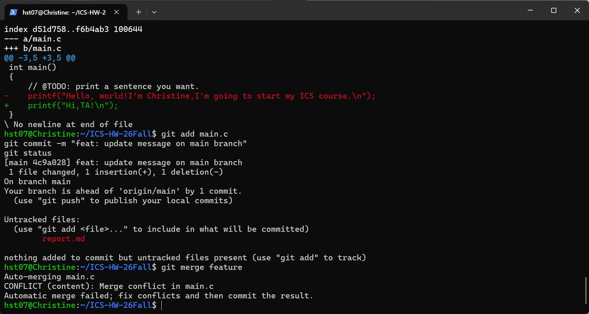
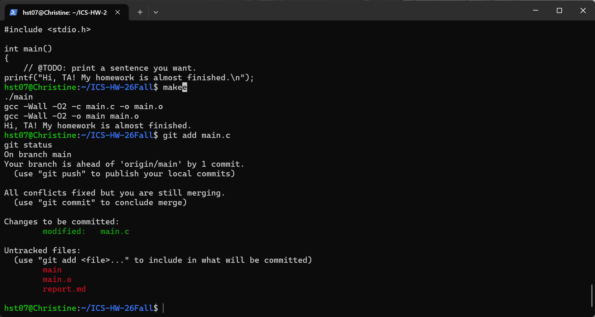
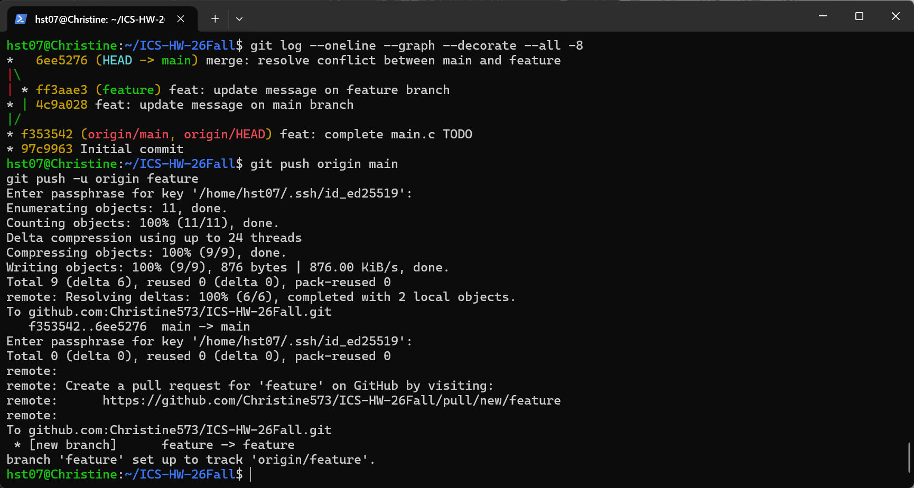

# Lab 0：GitLab 实验报告

- GitHub 用户名：Christine573
- 实验日期：2026.9.18


## 1. Git 基础问题

### 1.1 多人协同开发经历

我之前有多人协同开发的经历。刚上大一的时候参加了一场黑客松，当时呢我们团队使用腾讯共享文档共同编写项目规划和功能设计，但项目的主体代码主要由一名成员通过 Vibe Coding 完成，其他成员则负责测试、发现问题以及提出新功能。

这种协作方式存在不少困难。由于缺少统一的版本管理工具，不同成员可能同时基于不同版本修改项目：一名成员修改某部分代码时，另一名成员可能已经修改了其他部分，合并时容易发生覆盖，甚至导致已经完成的修改或 Bug 修复失效。团队还需要不断在群聊中发送最新版项目文件，但成员往往难以准确了解其他人修改了哪些内容（由于可能会有不同的人提出各种修改，不清楚具体到底改了多少），也无法方便地追踪不同版本之间的差异。

当时对git其实还没有什么了解，现在发现当时如果知道git的话其实可以省去许多麻烦。毕竟git可以让我们各自完成自己的任务，还可以通过提交记录去查看修改的内容，可以减少一些无效重复的工作，不至于搞半天还得确认哪个才是最终版。

### 1.2 Git 为什么设计“暂存—提交”两个步骤？

我的理解是，暂存区用于选择下一次提交要包含的修改，而提交则会把暂存区中的内容记录为一个正式版本。工作区中可以同时存在多项修改，开发者可以通过 `git add` 只暂存其中一部分，检查无误后再使用 `git commit` 提交。

设计成两个步骤，可以防止不小心把临时文件或者还不是终版的内容给提交了，也可以将不同目的的修改拆分成多个内容明确的提交。本次实验就是一个实际例子：我同时修改了 `main.c`，并新建了 `report.md`。第一次提交时，我只执行了 `git add main.c`，因此该次提交只包含程序代码，而实验报告仍保留在工作区中，之后等我写完可以单独提交。


### 1.3 `git branch` 与 `git branch -a` 的区别

- `git branch`：默认只列出本地分支，并使用星号标记当前所在的分支。
- `git branch -a`：会列出本地分支以及本地已经获取到的远程跟踪分支，例如 `remotes/origin/main`。因此，当需要查看当前仓库中所有已知的本地和远程分支时，可以使用 `git branch -a`。

git branch 适合查看本地分支；git branch -a 适合查看当前仓库中所有已知的本地分支和远程跟踪分支。

## 2. 修改并运行 `main.c`

### 2.1 修改内容

原文件中的 TODO 是：

```c
// @TODO: print a sentence you want.
```

我将程序修改为：

```c
 printf("Hello, world!I'm Christine,I'm going to start my ICS course.\n");
```


### 2.2 编译和运行

我在仓库目录中依次执行：

```bash
make
./main
make clean
```

程序的运行结果：

```text
Hello, world!I'm Christine,I'm going to start my ICS course.
```

### 2.3 第一次提交

我执行了以下命令：

```bash
git add main.c
git commit -m "feat: complete main.c TODO"
```

本次提交的 commit 信息或编号：

```text
f353542
```

## 3. 阅读材料与思考

三篇文章我都读了一下，选择两篇写一写：
- Commit Message 规范
- 语义化版本

### 3.1 第一篇材料：Commit Message 规范


这篇材料主要介绍了 Git 提交信息的常用写法和规范。提交信息一般需要简要说明这次修改的类型和内容，例如 `feat` 表示新增功能，`fix` 表示修复问题，`docs` 表示修改文档等。统一的格式可以让提交历史更加清楚，也方便查找修改记录和生成更新日志。

我的理解和收获：

我以前更关注代码是否完成，没有充分意识到提交说明也是项目记录的一部分。如果提交次数很多，清楚的说明可以节省很多查看代码的时间。在多人协作时，它还能帮助团队定位某项功能或 Bug 修复是在哪次提交中完成的。本次实验中，我使用了 `feat: complete main.c TODO` 作为提交信息，以后提交代码时，我会尽量把修改目的写清楚。

### 3.2 第二篇材料：Git Flow 分支控制

这篇文章主要介绍了如何使用不同的 Git 分支管理项目。Git Flow 会根据不同开发任务建立用途明确的分支：`main` 分支保存稳定、可以发布的代码，`develop` 分支用于汇总开发中的内容，`feature` 分支用于开发新功能，`release` 分支用于发布前的测试和修复，`hotfix` 分支用于紧急修复已经发布版本中的问题。各项工作在独立分支中完成，完成某项任务后，再把对应分支合并回去。


我的理解和收获：

Git Flow 可以把不同成员和不同任务的修改隔离开，避免大家直接修改同一份代码而造成覆盖或版本混乱。我之前参加黑客松时，团队主要通过群聊传递最新版项目文件，很难了解其他成员具体修改了什么，也可能出现已经完成的修改或 Bug 修复被覆盖的情况。如果使用 Git Flow，每个人可以在自己的分支上工作，完成后再合并，修改过程会更清楚。虽然刚开始操作分支可能有点麻烦，但比手动传文件更适合多人合作。

### 3.3 为什么要学习 Git？

结合以上材料和本次实验，我认为学习 Git 的原因包括：

1. Git 可以记录每次代码修改，出现问题时能够查看历史记录，找到是哪次修改造成的。
2. Git 可以通过分支让不同成员分别完成任务，再将修改合并起来，减少文件被覆盖和版本混乱的情况。
3. Git 配合 GitHub 可以保存和共享项目，团队成员也能通过 Commit Message 了解其他人做了哪些修改。

我的总结：

Git 不只是一个保存代码的工具，它还提供了提交记录、分支和合并等功能，可以让项目的修改过程更清楚。刚开始使用命令可能有些不习惯，但掌握之后应该能减少多人协作中的重复修改和文件覆盖问题。在下一次团队协作的项目中，我会尝试着使用git去更高效地完成任务。

## 4. Git 分支管理与冲突解决

### 4.1 创建 `feature` 分支

我执行了：

```bash
git switch -c feature
```

随后，我在 `feature` 分支中修改了 `main.c`，并执行：

```bash
git add main.c
git commit -m "feat: update message on feature branch"
```

`feature` 分支中的修改内容：

```c
printf("My homework is almost finished.\n");
```

### 4.2 在 `main` 分支修改同一位置

我切换回 `main` 分支：

```bash
git switch main
```

我在 `main` 分支中修改了 `main.c` 的同一位置，并执行：

```bash
git add main.c
git commit -m "feat: update message on main branch"
```

`main` 分支中的修改内容：

```c
printf("Hi,TA!\n");
```

### 4.3 合并分支并产生冲突

我在 `main` 分支执行：

```bash
git merge feature
```

因为两个分支分别修改了 `main.c` 的同一位置，Git 无法自动判断应该保留哪一项修改，因此产生了合并冲突。

合并冲突的终端输出：

```text
Auto-merging main.c
CONFLICT (content): Merge conflict in main.c
Automatic merge failed; fix conflicts and then commit the result.
```

冲突截图：



### 4.4 解决冲突

我删除了 Git 生成的冲突标记，并结合两个分支的内容，将最终代码修改为：

```c
printf("Hi, TA! My homework is almost finished.\n");
```

随后执行：

```bash
make
./main
git add main.c
make clean
git commit -m "merge: resolve conflict between main and feature"
```

程序能够正常编译和运行，冲突也成功解决。

冲突解决后的截图：



### 4.5 查看提交历史

我执行了：

```bash
git log --oneline --graph --decorate --all -8
```

提交历史截图：



## 5. 实验总结

通过本次实验，我学习了：

1. 如何从 GitHub 克隆仓库。
2. 如何使用 `git add` 和 `git commit` 提交修改。
3. 如何创建和切换 Git 分支。
4. 如何合并分支并解决合并冲突。
5. 如何使用 `git push` 将本地提交上传到 GitHub。

我在实验中遇到的问题：

我之前已经在 Windows 中配置了 SSH 密钥，但是在 WSL 中执行 `ssh -T git@github.com` 时出现了 `Permission denied (publickey)`。经过检查，我发现 Windows 和 WSL 使用不同的用户目录，WSL 中的 SSH 默认从 WSL 用户的 `~/.ssh` 目录查找密钥，不会自动使用 Windows 用户目录中的私钥。

我的解决方法：

我将 Windows 中的 SSH 密钥复制到 WSL 的 `~/.ssh` 目录，并重新设置文件权限：

```bash
mkdir -p ~/.ssh
cp /mnt/c/Users/27303/.ssh/id_ed25519 ~/.ssh/
cp /mnt/c/Users/27303/.ssh/id_ed25519.pub ~/.ssh/
chmod 700 ~/.ssh
chmod 600 ~/.ssh/id_ed25519
chmod 644 ~/.ssh/id_ed25519.pub
```

随后再次执行：

```bash
ssh -T git@github.com
```

终端显示身份验证成功，之后我就可以在 WSL 中使用 SSH 克隆和推送 GitHub 仓库了。

## 6. 建议

课程文档和 GitHub 文档已经介绍了 SSH 密钥的配置及常见认证问题。如果课程文档能进一步增加一个 Windows 与 WSL 配合使用的示例，说明两者的 SSH 密钥目录相互独立，以及如何在 WSL 中使用 Windows 已有的密钥，会更方便使用多个开发环境的同学排查问题。(有可能是我不够熟悉，但是还是补充一下)